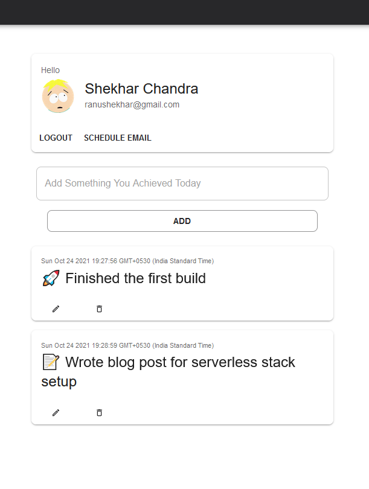

# SelfZine : Periodic newsletter curated by you mailed by us


[Live Server](https://selfzine-worker.makeall.workers.dev/)

[Blog post](https://makeall.dev/notepad/cloudflare-serverless-stack-scaffold/) explaining the build process and setup

## Features

* Add what you accomplished today
* We will keep the ten most recent activities
* A newsletter like mail will be sent to you as per your schedule

## Build & Run

```sh
cd  src/selfzine-ui
npm run build

cd ../selfzine-worker
wrangler publish
```

## Screenshot

